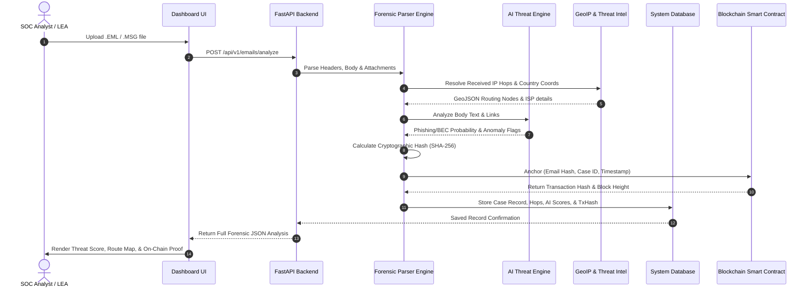

# Architecture Specification: AI-Powered Email Threat Detection, GeoLocation & Forensic Intelligence Platform

**SIH PS ID:** 26106  
**System Architecture Overview**

---

## 1. High-Level System Architecture

```mermaid
flowchart TB
    subgraph Client Layer ["Client Layer (Frontend)"]
        UI["React Cyber Dashboard"]
        Uploader["Drag-and-Drop EML/MSG Ingestion"]
        MapViz["Interactive Geo Routing Map (Leaflet)"]
        ReportViewer["Forensic PDF / Chain of Custody Viewer"]
    end

    subgraph API Gateway ["API Gateway & Controller"]
        FastAPI["FastAPI REST Server Engine"]
        AuthSystem["JWT & RBAC Security Layer"]
    end

    subgraph Core Processing Engine ["Core Forensic Processing Engine"]
        Parser["EML / MSG Header & MIME Parser"]
        HopAnalyzer["Received Header Router & Latency Calculator"]
        AttachmentScan["Attachment Hash & YARA Classifier"]
        URLInspector["Domain WHOIS & Typosquatting Analyzer"]
    end

    subgraph AI Intelligence Layer ["AI & Machine Learning Engine"]
        BECClassifier["BEC & CEO Fraud Detection Model"]
        PhishNLP["NLP Intent & Urgency Classifier"]
        AnomalyScorer["Header Anomaly & Spoof Score Generator"]
    end

    subgraph OSINT Services ["OSINT & GeoIP Services"]
        GeoIP["MaxMind / IPinfo GeoIP Engine"]
        ThreatIntel["AbuseIPDB / VirusTotal API Gateway"]
    end

    subgraph Data & Storage ["Data & Storage Layer"]
        RelationalDB[("PostgreSQL / SQLite Database")]
        Vault["Encrypted Evidence Storage (Raw EML)"]
    end

    subgraph Blockchain Layer ["Blockchain Chain of Custody Ledger"]
        Web3Provider["Web3.py / Ethers.js Bridge"]
        SmartContract["Evidence Registry Smart Contract"]
        Blockchain[("EVM / Polygon / Local Ledger")]
    end

    %% Flow Connections
    Client Layer -->|HTTPS / Multipart Upload| API Gateway
    FastAPI --> Core Processing Engine
    Core Processing Engine --> AI Intelligence Layer
    Core Processing Engine --> OSINT Services
    Core Processing Engine --> Data & Storage
    AI Intelligence Layer --> Data & Storage
    Core Processing Engine -->|Generate SHA-256 Hash| Blockchain Layer
    Blockchain Layer -->|Store Transaction Hash & Merkle Root| RelationalDB
    API Gateway -->|Fetch JSON & Map GeoJSON| Client Layer
```

---

## 2. Component Breakdown

### 2.1 Frontend Component Architecture
- **Dashboard Core:** Modern dark cyber design with responsive navigation cards.
- **Forensic Map Component:** Renders geographical nodes for originating IP, intermediate relay mail servers, and destination server using Leaflet.js vectors.
- **Timeline Component:** Visualizes header timestamp diffs to detect server delays and potential header injection.
- **Evidence Vault UI:** Displays case lists, cryptographic hashes (SHA-256), and direct links to on-chain verification.

### 2.2 Backend Microservices (FastAPI)
- **`parser_service.py`:** Parses raw RFC 822 email headers, extracts headers, body (HTML/Plain text), inline images, and attachments.
- **`geoip_service.py`:** Extracts IP addresses from `Received: from ...` headers, sanitizes local/private IPs (RFC 1918), and queries GeoIP databases for geolocation (lat, long, country, city, ISP, ASN).
- **`threat_service.py`:** Calculates SPF, DKIM, DMARC alignment status, identifies spoofed display names vs actual sender addresses, and analyzes embedded URLs for typosquatting.
- **`ai_service.py`:** Runs lightweight ML models (vectorizer + classifier) on email body text to identify high-risk categories: BEC, Financial Fraud, Credential Harvesting, and Scam.
- **`blockchain_service.py`:** Computes SHA-256 hash of raw email content + forensic metadata, signs the payload, and commits it to a smart contract (`EmailEvidenceRegistry.sol`).

---

## 3. Data Processing Flow



---

## 4. Scalability & Deployment Architecture

- **Containerization:** Docker container for FastAPI backend and Vite frontend.
- **Asynchronous Task Queue:** Celery / Redis background queue for bulk ingestion of `.mbox` archives or multi-file forensic cases.
- **Extensibility:** Plug-and-play architecture for YARA rules and external threat feeds (AlienVault OTX, VirusTotal, AbuseIPDB).
