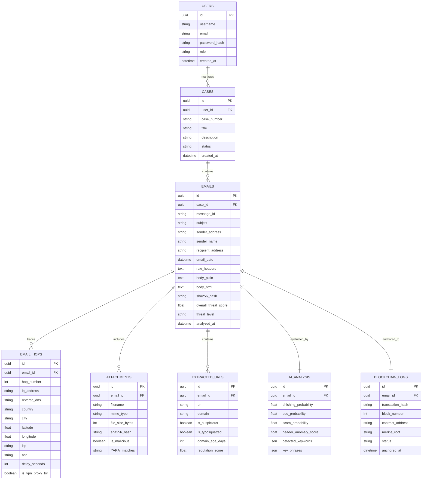

# Database Schema Specification: Forensic Intelligence Platform

**SIH PS ID:** 26106  
**Relational Model (PostgreSQL / SQLite)**

---

## 1. Entity Relationship Diagram (ERD)

---

## 2. Table Specifications

### 2.1 `cases`
Stores forensic investigation cases created by investigators.
- `id` (UUID, Primary Key)
- `case_number` (VARCHAR(50), Unique, e.g. `CASE-2026-0089`)
- `title` (VARCHAR(255))
- `description` (TEXT)
- `status` (VARCHAR(20), e.g. `OPEN`, `IN_PROGRESS`, `CLOSED`, `ARCHIVED`)
- `created_at` (TIMESTAMP)

### 2.2 `emails`
Stores core metadata and raw content hash of analyzed emails.
- `id` (UUID, Primary Key)
- `case_id` (UUID, Foreign Key -> `cases.id`)
- `message_id` (VARCHAR(255))
- `subject` (TEXT)
- `sender_address` (VARCHAR(255))
- `sender_name` (VARCHAR(255))
- `recipient_address` (VARCHAR(255))
- `email_date` (TIMESTAMP)
- `raw_headers` (TEXT)
- `sha256_hash` (VARCHAR(64), Unique - Used for Blockchain non-repudiation)
- `overall_threat_score` (FLOAT, 0.0 to 100.0)
- `threat_level` (VARCHAR(20), e.g. `CLEAN`, `SUSPICIOUS`, `HIGH_RISK`, `CRITICAL`)

### 2.3 `email_hops`
Stores sequential routing hops extracted from `Received:` headers.
- `id` (UUID, Primary Key)
- `email_id` (UUID, Foreign Key -> `emails.id`)
- `hop_number` (INTEGER, 1 = Originating server)
- `ip_address` (VARCHAR(45))
- `country` (VARCHAR(100))
- `city` (VARCHAR(100))
- `latitude` (FLOAT)
- `longitude` (FLOAT)
- `isp` (VARCHAR(255))
- `delay_seconds` (INTEGER)
- `is_vpn_proxy_tor` (BOOLEAN)

### 2.4 `blockchain_logs`
Stores immutable proof details of evidence submitted to the Smart Contract.
- `id` (UUID, Primary Key)
- `email_id` (UUID, Foreign Key -> `emails.id`)
- `transaction_hash` (VARCHAR(66))
- `block_number` (INTEGER)
- `contract_address` (VARCHAR(42))
- `merkle_root` (VARCHAR(64))
- `status` (VARCHAR(20), `CONFIRMED`, `PENDING`)
- `anchored_at` (TIMESTAMP)

---

## 3. Database Constraints & Indexes

1. **Unique Index:** `emails(sha256_hash)` to prevent duplicate forensic evidence records and speed up lookup.
2. **Composite Index:** `email_hops(email_id, hop_number)` for fast sequential rendering of route maps.
3. **Foreign Key Constraints:** Cascade deletes on `email_hops`, `attachments`, and `extracted_urls` when an `email` record is removed.
