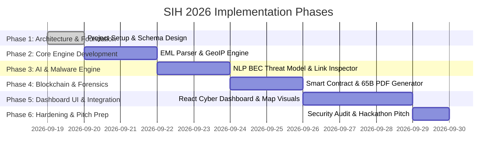

# SIH 2026 Project Plan: AI-Powered Email Threat Detection, GeoLocation & Forensic Intelligence Platform

**Problem Statement ID:** 26106  
**Organization:** AICTE – Cyber Security Cell  
**Theme:** Blockchain & Cybersecurity  
**Target Repository:** `/Users/gagan/Email forensics`  

---

## 1. Executive Summary

Email remains the primary attack vector for cybercrime, ranging from phishing, Business Email Compromise (BEC), CEO fraud, malware dissemination, and spear-phishing campaigns. Investigating email threats requires deep header analysis, hop-by-hop geolocation routing, NLP-driven threat scoring, and verifiable evidence preservation for legal admissibility in court.

This platform provides an end-to-end, AI-powered forensic ecosystem that ingests raw email files (`.eml`, `.msg`, `.mbox`), performs automated threat scoring and header tracing, geolocates infrastructure hops, extracts attachments for static malware analysis, and anchors evidence digests onto a Blockchain ledger for immutable Chain of Custody verification.

---

## 2. Project Scope & Objectives

### Core Objectives:
1. **Header & Hop Analysis:** Automated parsing of `Received`, `SPF`, `DKIM`, `DMARC`, `Authentication-Results`, `X-Headers`, and server delays.
2. **GeoLocation & Route Mapping:** Interactive geographical mapping of email hops from sender origin to target inbox, pinpointing VPN/Proxy/TOR exit nodes.
3. **AI Threat Engine:** Multi-layer AI detection combining TF-IDF/Transformer NLP models for BEC/Phishing detection, header anomaly scoring, and link reputation analysis.
4. **Forensic Evidence & Blockchain Anchor:** Hash calculation (SHA-256) of raw email artifacts with automated smart contract anchoring on an EVM-compatible blockchain to ensure evidence non-repudiation and court admissibility (IT Act / Section 65B certificate generation).
5. **Interactive Forensic Dashboard:** High-impact, dark cyber-themed interface featuring route maps, timeline graphs, threat matrices, and exportable forensic PDF reports.

---

## 3. Technology Stack Justification

| Layer | Technology | Justification |
| :--- | :--- | :--- |
| **Frontend** | React (Vite) + Vanilla CSS / Modern UI tokens | High performance, rapid component rendering, sleek dark cyber aesthetic, glassmorphism UI. |
| **Mapping & Visuals** | Leaflet.js / Chart.js | Interactive global mapping for email hop routing and dynamic threat metrics graphs. |
| **Backend API** | Python 3.11 + FastAPI | Native Python support for email parsing (`mailparser`, `email`), AI/ML libraries, and high asynchronous throughput. |
| **AI / NLP Engine** | Scikit-Learn + HuggingFace / Custom Heuristics | Lightweight, fast classification for spam/phishing/BEC with anomaly scoring rules. |
| **Database** | SQLite (Dev) / PostgreSQL (Prod) + SQLAlchemy | Robust relational schema for cases, emails, hops, attachments, and blockchain audit entries. |
| **Blockchain** | Ethers.js / Web3.py + Local EVM / Polygon | Cryptographic hash registry for tamper-proof Chain of Custody logging. |
| **OSINT / Intelligence** | MaxMind GeoIP2 / IPinfo / VirusTotal API | IP geolocation, ISP resolution, and domain/URL reputation lookups. |

---

## 4. Phase-by-Phase Implementation Roadmap

---

## 5. SIH Evaluation Criteria Alignment

- **Innovation:** Integration of Blockchain Chain of Custody with AI-driven email forensic analysis.
- **Feasibility:** Modular FastAPI microservices with standalone frontend for rapid deployment.
- **Impact:** Directly empowers Law Enforcement Agencies (LEAs), AICTE Cyber Security Cell, and SOC analysts to investigate email crimes faster.
- **User Experience:** Instant visual graph of email transit across countries with clear threat indicators.
